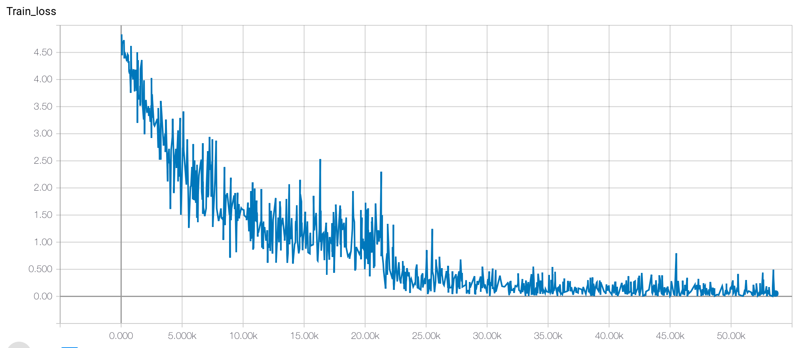

C3D by PyTorch
=====

## Introduction
We reproduce the results of C3D [1] in UCF101 [2] and test the performance in DogCentric Activity dataset [3].

## Requirements

To install requirements, please have Python 3 in your environment, then run

```bash
$ pip install -r requirements.txt
```

## Dataset

* To download UCF101 please visit [http://crcv.ucf.edu/data/UCF101.php](http://crcv.ucf.edu/data/UCF101.php) to download a rar archive.
Please extract the archive and modify the [train](https://github.com/chuckcho/video-caffe/blob/master/examples/c3d_ucf101/c3d_ucf101_train_split1.txt) and [test](https://github.com/chuckcho/video-caffe/blob/master/examples/c3d_ucf101/c3d_ucf101_test_split1.txt) lists of [`video-caffe`](https://github.com/chuckcho/video-caffe) to match the video paths.

* To download the [DogCentric Activity dataset](http://robotics.ait.kyushu-u.ac.jp/yumi/db/first_dog.html), please run the script [`static/videos/download_dogcentric.sh`](./static/videos/download_dogcentric.sh) in the directory `static/videos`.

```bash
$ cd static/videos
$ bash download_dogcentric.sh
```

# Results
### Results in UCF101

* Pre-processing of clips is done similar to what in [`video-caffe`](https://github.com/chuckcho/video-caffe) and in [1].
Details can be found in `UCF101ClipTrainer` class.

* Training on split1 of UCF101 dataset took 10 hours for 10 epochs. Learning curve looks similar to that of [`video-caffe`](https://github.com/chuckcho/video-caffe) implementation:



* Testing is done at about 50 clips per second (each clip has 16 frames like in [1]).
In split1, we obtained 44.72% top-1 clip accuracy, which is close to what described in [`video-caffe`](https://github.com/chuckcho/video-caffe).
[1] described that the original C3D achieved around 47% accuracy (compared to the best architecture in [1, Figure 3], we disabled `conv3b, conv4b, conv5b` for faster inference).
Automatic search for neural architectures for 3D data is interesting, some recent researches did it (such as [iTGM](https://arxiv.org/pdf/1811.10636.pdf)).

* Training and testing details can be traced from `train_ucf101.py` and `test_ucf101.py` files.

* Pretrained models of first 10 epochs can be downloaded from [Dropbox](https://www.dropbox.com/sh/mzr9fazsfkfjpyx/AAAUU2R31galLpRrK97QOjBEa?dl=0).

### Results in DogCentric Activity dataset

* Extracted C3D features can be obtained from [`static/features/`](./static/features).

* Added a [BoVW+SVM example](./dogcentric.ipynb) with C3D features.


## What to do next?

* Maybe Dogs' representation learning with [DECADE dataset](https://github.com/ehsanik/dogTorch) [4]?

## References

[1] D. Tran, L. Bourdev, R. Fergus, L. Torresani, and M. Paluri, "**Learning Spatiotemporal Features with 3D Convolutional Networks**", ICCV 2015.

[2] K. Soomro, A.-R. Zamir and M. Shah, "**UCF101: A Dataset of 101 Human Action Classes From Videos in The Wild**", CRCV-TR-12-01, November, 2012. 

[3] Y. Iwashita, A. Takamine, R. Kurazume, and M. S. Ryoo, "**First-Person Animal Activity Recognition from Egocentric Videos**", ICPR 2014. 

[4] Kiana Ehsani, Hessam Bagherinezhad, Joseph Redmon, Roozbeh Mottaghi, and Ali Farhadi, "**Who Let The Dogs Out? Modeling Dog Behavior From Visual Data**", CVPR 2018.
